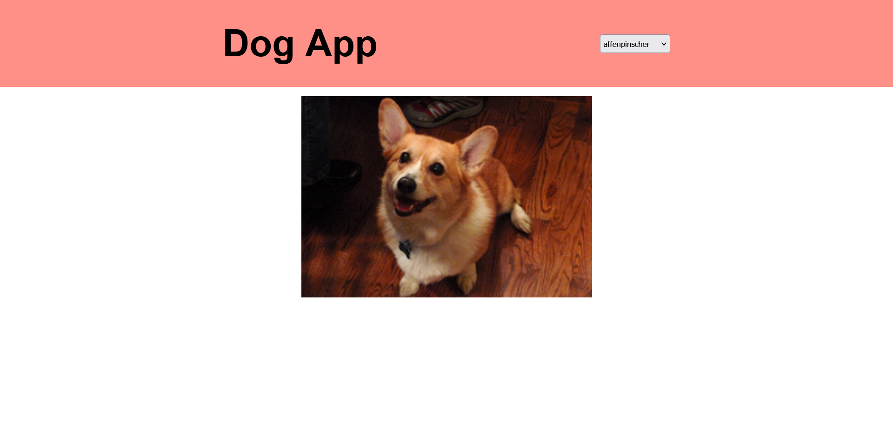

# Frontend Masters - Bootcamp

This project is a part of [Frontend Masters Bootcamp](https://frontendmasters.com/bootcamp/).

## Table of contents

- [Overview](#overview)
  - [Screenshot](#screenshot)
  - [Links](#links)
- [My process](#my-process)
  - [Built with](#built-with)
  - [What I learned](#what-i-learned)
  - [Useful resources](#useful-resources)
- [Author](#author)

## Overview

### Screenshot

### Links

- [View live](https://junaidshaikh-js.github.io/dog-app/)

## My process

### Built with

- Semantic HTML5 markup
- CSS custom properties
- CSS Flexbox
- JavaScript

### What I learned

I learned about AJAX (Asynchronous JavaScript And XML). I learned to use Fetch API in JavaScript, and after than how to handle the data and work with it. Also, I worked with the JSON (JavaScript Object Notation).

### Useful resources

- [How AJAX work](w3schools.com/xml/ajax_intro.asp) - Checkout this article on how AJAX work.

## Author

- Linkedin - [@junaidshaikhjs](https://www.linkedin.com/in/junaidshaikhjs/)
- Twitter - [@junaidshaikh_js](https://twitter.com/junaidshaikh_js)
